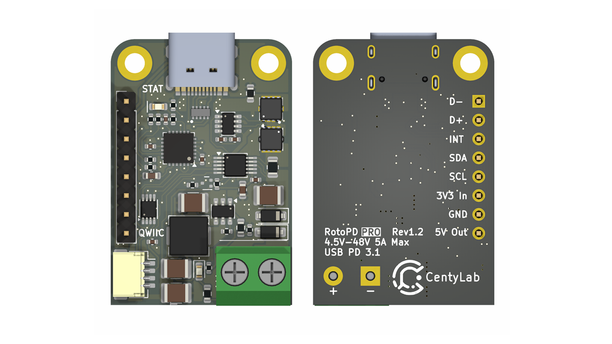
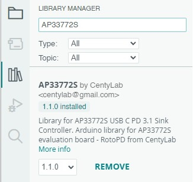
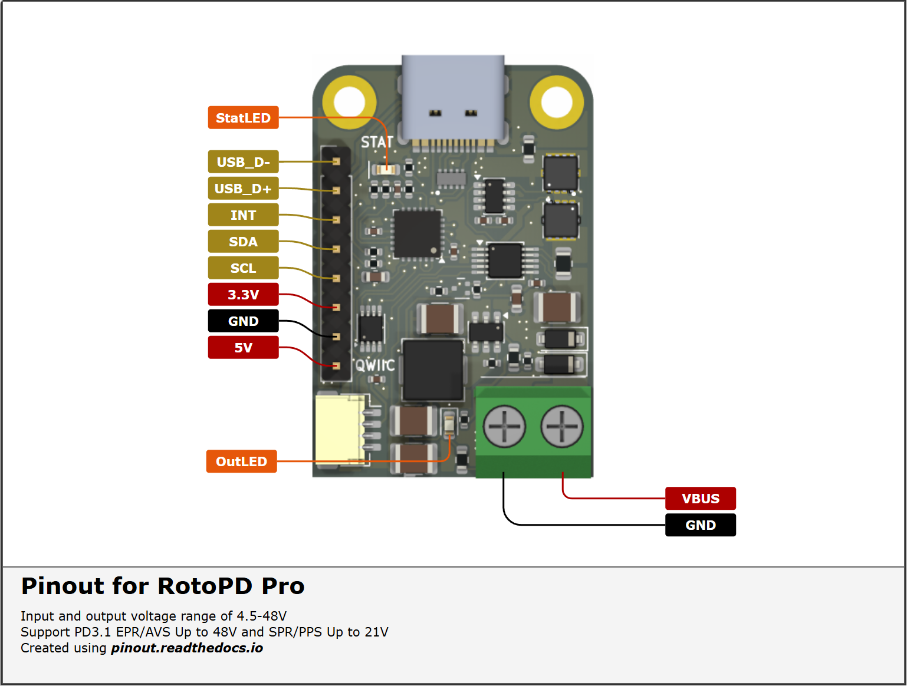
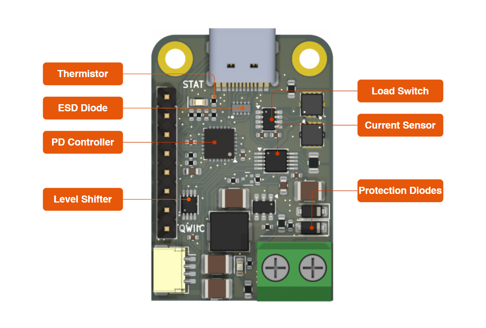
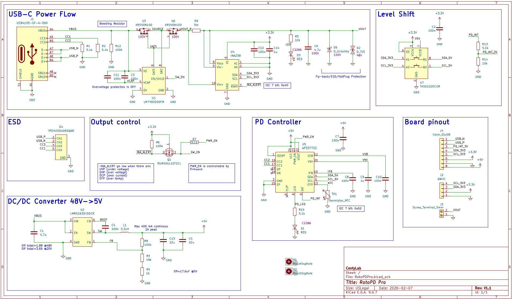

## RotoPD Pro - USB-C PD 3.1 Breakout I2C 240W

## Related Links
- [AP33772S Arduino - GitHub](https://github.com/CentyLab/AP33772S-CentyLab)
- [INA238 Arduino - GitHub](https://github.com/RobTillaart/INA238)
- [RotoPD Pro Project - Hackaday](https://hackaday.io/project/204943-rotopd-pro-usb-c-240w-breakout-i2c)

You can install the libraries directly on ArduinoIDE

## Description

While traditional power adapters can provide a variety of current but fixed to 5V output, our RotoPD Pro leverages advanced power delivery protocols to achieve a versatile output range — 4.5V to 48V at 240W max. The breakout board use a stand alone Power Delivery Sink controller to negotiate with your modern charger and provide different output voltage.

Centylab's RotoPD Pro can unlock more advance mode in your USB-C power supplies like Programmable Power Supply (PPS) and Adjustable Voltage Supply (AVS), to provide even more granular voltage adjustment. The RotoPD Pro simplifies power negotiation with USB-C adapters, handling the complex process of establishing power delivery contracts. The controller does all the heavy lifting of power negotiation and provides an easy way to configure over I2C, free your micro-controller from the complicated USB-C PD protocol.

To config the board, you will need an I2C bus. The board integrates seamlessly into the Qwiic and STEMMA QT ecosystems, no soldering is required. Unlike the previous version, the board only work with **3.3V I2C logic voltage.**

To make it even easier to use, RotoPD Pro includes a built-in buck converter that efficiently steps down USB-C VBUS power to a stable 5V output, making it perfect for powering microcontrollers, sensors, and other low-voltage components in your project.

## Requirements for AVS
To ultilize AVS power profile, you will need a powerbank or charger that has AVS profile and a 240W USB-C cable. Here are some chargers that we found support AVS profile.

+ [Framework 180W](https://frame.work/products/16-power-adapter)

+ [Framework 240W](https://frame.work/products/power-adapter-240w)

+ [AMEGAT Powerbank 140W](https://www.amazon.com/AMEGAT-27600mAh-Portable-Recharge-Compatible/dp/B0CC2CGD3L)

+ [Baseus Powerbank 140W](https://www.amazon.com/Baseus-Portable-Charger-24000mAh-Charging/dp/B0CH8D2YHZ)

+ [UGREEEN Nexode 300W](https://www.amazon.com/UGREEN-Charger-Charging-Station-Compatible/dp/B0DBZY57ZF)

## Specification
+ Input and output voltage range of  48V at 5A max
+ On board buck for 5V output at 1A max, 0.4A continuous
+ Support Qwiic or STEMMA QT in 3.3V Only
+ Support PD3.1 EPR/AVS Up to 48V and SPR/PPS Up to 21V
+ Certified USB PD3.1 v1.6  TID: 10062
+ Integrated ESD and flyback diode protection
+ Integrated NTC temperature monitoring
+ On board VBUS switch (back-to-back NMOS)
+ Current sensing from 0 to 5 A at ±2% accuracy up to 60C

## Pinout

## Schematic

## Demo
AVSFixed example with Sparkfun Pro Micro ESP32-C3. We are requesting AVS 28V.

